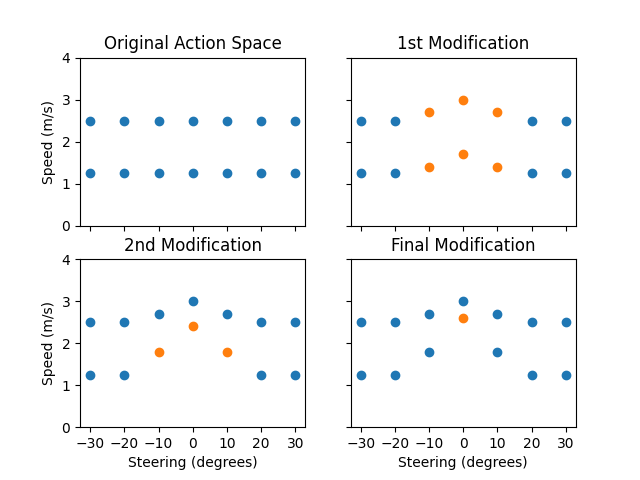

# 

<p align = center>
  
  
  
  
  
  
</p>

## About
This README provides an overview of how our team approached the University of Sydney's 2020 [AWS DeepRacer](https://aws.amazon.com/deepracer/) competition. This was a competition run by the School of Computer Science which provided teams with AWS credits to develop and train a DeepRacer model. Over the course of the model's development it was necessary to define an action space, develop a reward function for reinforcement learning, and experiment with various hyper-parameters controlling the underlying 3-layer neural network.

<p align="center">

</p>

### Team
- [Ashan Abey](https://github.com/ashton3000)
- [Georgia Markham](https://github.com/georgiemarkham)
- [Matthew Suntup](https://github.com/MatthewSuntup)

### Contents
- [About](#About)
- [Results](#Results)
- [Development](#Development)
  - [Qualifier Model](#Qualifier-Model)
  - [Finals Model](#Finals-Model)

## Results
### USYD 2020 Finals (1st Place)
#### Track - Circuit de Barcelona-Catalunya
<p align="center">

</p>

### USYD 2020 Qualifier (1st Place)
#### Track - 2019 DeepRacer Championship Cup
<p align="center">

</p>

## Development
### Qualifier Model
#### Defining the action space
The qualifier track was the 2019 DeepRacer Championship Cup track, which is a relatively straightforward loop with minor turns. We chose an action space with as few actions as possible (to reduce training time) while maintaining what we believed to be necessary actions to complete the track at speed. We chose a maximum speed of 3 m/s as a result of trial and error racing similar models with 2 and 4 m/s maximum speeds. A slower speed of 1.5 m/s was also chosen, allowing the vehicle to achieve intermediate speeds by switching between the two. As the turns are relatively smooth on this track, we limited the steering to 20 degrees, but still found it useful to include an intermediate steering angle for smaller corrections.

<p align="center">

</p>

#### Iterating the reward function
Initially, we trained the model on the much simpler Oval and Bowtie tracks using a centreline-following reward function with an incentive for faster speeds while travelling straight.

<p align="center">

</p>

The sub-rewards can be seen in this code snippet from [reward_simple.py](reward/reward_simple.py):

```python
  # Strongly discourage going off track
  if not all_wheels_on_track or is_offtrack:
      reward = 1e-3
      return float(reward)

  # Give higher reward if the car is closer to centre line and vice versa
  # 0 if you're on edge of track, 1 if you're centre of track
  reward = 1 - distance_from_center/(track_width/2)

  # Reward going faster when the car isn't turning
  if abs(steering_angle) < 10 and speed > 2:
      reward += speed/max_speed
```
Note that we chose to add sub-rewards rather than multiply them, based on the experience of Daniel Gonzalez shared in "[An Advanced Guide to AWS DeepRacer](https://towardsdatascience.com/an-advanced-guide-to-aws-deepracer-2b462c37eea)".

We realised that a linear incentive for staying near the centre of the track would be limiting for the vehicle when it would be faster to "cut" the curvature of a turn. So the linear centreline sub-reward was replaced by a quadratic one, which meant the reward was less sensitive to small movements away from the centreline:

```python
# Give higher reward if the car is closer to centre line and vice versa
# 0 if you're on edge of track, 1 if you're centre of track
reward = 1 - (distance_from_center/(track_width/2))**2
```

An additional sub-reward was also included to encourage the vehicle to progress through the track faster relative to the number of steps taken (note the step-rate is constant at 15 Hz).
```python
# Reward progress
reward += progress/steps
```

Once the model was demonstrating a basic ability to follow the simple tracks, we moved onto the 2019 DeepRacer Championship Cup track.
<p align="center">

</p>

A noticeable sticking point that the model ran into was an inability to take the North-West corner at high speeds (note this track is traversed anti-clockwise). Often it would approach the turn too quickly and be unable to position itself appropriately in time to take the turn successfully, an issue which we occasionally observed on other turns as well.  To address this, we implemented a method of detecting corners ahead of the vehicle using waypoint information and incentivised going slower in response to future corners.

```python
def identify_corner(waypoints, closest_waypoints, future_step):

    # Identify next waypoint and a further waypoint
    point_prev = waypoints[closest_waypoints[0]]
    point_next = waypoints[closest_waypoints[1]]
    point_future = waypoints[min(len(waypoints)-1,closest_waypoints[1]+future_step)]

    # Calculate headings to waypoints
    heading_current = math.degrees(math.atan2(point_prev[1]-point_next[1], point_prev[0] - point_next[0]))
    heading_future = math.degrees(math.atan2(point_prev[1]-point_future[1], point_prev[0]-point_future[0]))

    # Calculate the difference between the headings
    diff_heading = abs(heading_current-heading_future)

    # Check we didn't choose the reflex angle
    if diff_heading > 180:
        diff_heading = 360 - diff_heading

    # Calculate distance to further waypoint
    dist_future = np.linalg.norm([point_next[0]-point_future[0],point_next[1]-point_future[1]])  

    return diff_heading, dist_future
```

The `identify_corner()` function can be used to identify whether a corner exists between the car and a specified waypoint in the future. However, the spacing of waypoints is not consistent, so searching a constant number of waypoints ahead for a corner may cause the car to slow down unnecessarily when a corner is still far away. To mitigate this, after identifying a corner we check if it is within a minimum distance of the car. If not, the function is called again for a closer waypoint. We only use this method to check if a corner is too far away, as the identification of a far away straight almost always meant that the track prior was also straight due to both our method for identifying corners and the layout of this track.

```python
def select_speed(waypoints, closest_waypoints, future_step, mid_step):

    # Identify if a corner is in the future
    diff_heading, dist_future = identify_corner(waypoints, closest_waypoints, future_step)

    if diff_heading < TURN_THRESHOLD:
        # If there's no corner encourage going faster
        go_fast = True
    else:
        if dist_future < DIST_THRESHOLD:
            # If there is a corner and it's close encourage going slower
            go_fast = False
        else:
            # If the corner is far away, re-assess closer points
            diff_heading_mid, dist_mid = identify_corner(waypoints, closest_waypoints, mid_step)

            if diff_heading_mid < TURN_THRESHOLD:
                # If there's no corner encourage going faster
                go_fast = True
            else:
                # If there is a corner and it's close encourage going slower
                go_fast = False

    return go_fast
```
```python
# Implement speed incentive
go_fast = select_speed(waypoints, closest_waypoints, FUTURE_STEP, MID_STEP)

if go_fast and speed > SPEED_THRESHOLD:
    reward += 0.5

elif not go_fast and speed < SPEED_THRESHOLD:
    reward += 0.5  
```
#### Tuning Hyperparameters


### Finals Model
#### Defining the action space
The finals track was the Circuit de Barcelona-Catalunya track, which consists of many sharp turns. It quickly became evident that our qualifier model would not be suited to the significantly different requirements of this track.
<p align="center">

</p>

Previously, we had only been using the AWS DeepRacer console which provides barebone customisation options, and enforces a linearly spaced action space. One of the greatest drawbacks of this is the wasted actions involving high speeds and high steering angles (as these are almost never used, unless you set your maximum speed very low). Manually modifying the action space is detailed in Kire Galev's "[AWS DeepRacer Expert Boot Camp](https://www.youtube.com/watch?v=BUMbqn4NqQA&ab_channel=AWSDeepRacerCommunity)", and allows us to initialise the model with a linear space using a low max speed, and then increase the speeds of the actions with lower steering angles. Doing this forms a bell curve shape, which enables us to have less overall actions than otherwise would have been required for this track given a linear action space (thereby reducing training time).

However, we found that the fastest way to train a model like this was to first train it with a slow action space until it could reliably complete the course, and then increase the speed of specific actions before training it further to learn how to adapt to the new speeds. Repeating this process allowed us to rapidly improve the race time of the model. The process required significant trial and error to gauge the limits of how much the action space can stably be modified between training. The modifications that were trained along the way (disregarding failed attempts) are shown in this graph:

<p align="center">

</p>

Note that it was most effective to increase the speed of actions associated with slow speed and low steering angles, as these are only used when the vehicle is travelling straight and likely being overly cautious. The action space of the model that was entered into the finals race is shown below:

<p align="center">

</p>

#### Iterating the reward function
The reward function used for the qualifier remained suitable for this track in general. It was found that there was no need for the additional check used when calling the ```identify_corner()``` function to ensure we weren't looking too far ahead, as the waypoints for this track were spaced much more consistently.

```python
def select_speed(waypoints, closest_waypoints, future_step):

    # Identify if a corner is in the future
    diff_heading, dist_future = identify_corner(waypoints, closest_waypoints, future_step)

    if diff_heading < TURN_THRESHOLD_SPEED:
        # If there's no corner encourage going faster
        go_fast = True
    else:
        # If there is a corner encourage slowing down
        go_fast = False

    return go_fast
```

We noticed that since over much of the course, the model was not actively being incentivised to go fast and straight (due to conservative parameters used for identifying corners), some swerving behaviour was emerging. This was addressed with the addition of a sub-reward for keeping steering angles within a bound. The condition for this to be applied used the same ```identify_corner()``` function that the speed sub-reward utilises, but with different parameters leading to the model to be incentivised to keep straight for a larger proportion of the track than when it is incentivised to go fast.

```python
def select_straight(waypoints, closest_waypoints, future_step):

    # Identify if a corner is in the future
    diff_heading, dist_future = identify_corner(waypoints, closest_waypoints, future_step)

    if diff_heading < TURN_THRESHOLD_STRAIGHT:
        # If there's no corner encourage going straighter
        go_straight = True
    else:
        # If there is a corner don't encourage going straighter
        go_straight = False

    return go_straight
```
In pushing to make the model as fast as possible, the sub-reward incentivising progress was also modified to try and achieve specific targets.

```python
# Every 50 steps, if it's ahead of expected position, give reward relative
   # to how far ahead it is
   if (steps % 50) == 0 and progress/100 > (steps/TOTAL_NUM_STEPS):
       # reward += 2.22 for each second faster than 45s projected
       reward += progress - (steps/TOTAL_NUM_STEPS)*100
```

The ```TOTAL_NUM_STEPS``` parameter was modified to be slightly less than the time the model was currently achieving multiples by 15 steps per second. By the final model it was set to 675, corresponding to 45s.
